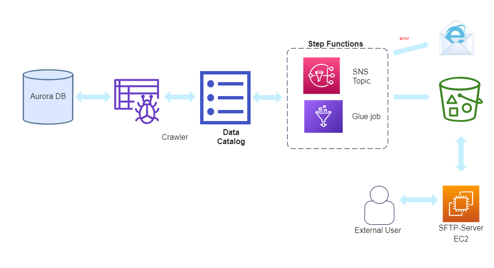

# Solution Overview

- Glue crawler connects to Aurora Database and creates tables in the Glue Data Catalog
- Glue Job joins the tables to create the final Dataframe
- Dataframe is partitioned by bank name, year and month and written to s3.
- Using s3-concat Python library, the S3 files are combined into a single file and the correct naming is applied.
- Step function is used to schedule and orchestrate the Glue Job. 
-- If the Glue Job does not succeed, Message is published to SNS topic and sent to data-support@mybigbank.co.za

Architecture :

# How it can be improved
- Complete setup of SFTP S3 mount server and provide external users with simple GUI
- Modify role permissions for least privilege
- Improve templatisability
- Improve idempotency:
-- Current Job processes all data in DB at once. Job should be modified for incremental loads
-- Jos should keep track of previous runs to avoid data reprocessing
- Use secrets manager to store and rotate RDS password
- Remove part files after merging and renaming files