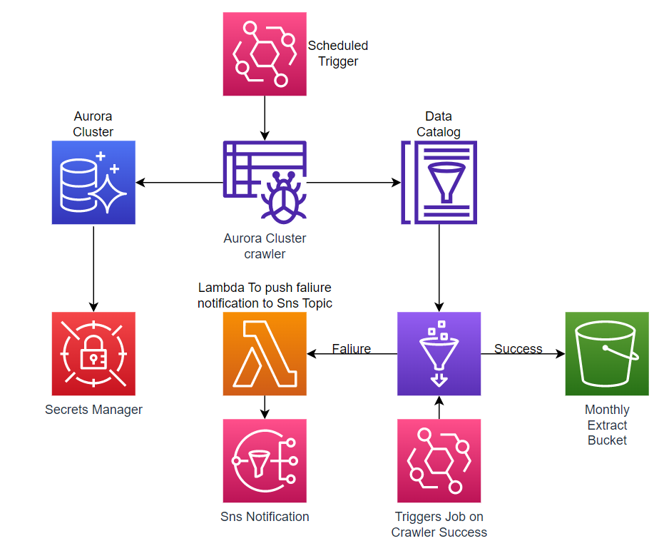

## Overview

The solution will use a glue crawler to get the tables from the database assoicated with the banking model, this will run on the first of every month. On the completion of the crawler, new tables will appear in the Data Catalog and a GlueJob will be triggered by a workflow. The GlueJob will be able to connect to the tables in Data Catalog Database and the ETL process to produce the outputs in the following s3 location `s3://{BucketName}/output/{Bank Name}/{year}/{month}/` then job is successful. In the event that the Job Fails a SNS notification will be sent out containing the GlueJob error. Passwords for the Cluster will be stored in Secrets Manager and rotated and data in the S3 bucket will be encryted.

## Diagram

## Prerequisites

- Terraform
- PySpark
- SQL
- WSL 2

## Steps

1. Sign into your aws profile in the CLI or use a configured profile
2. Deploy the Terraform script
3. Connect to Aurora Cluster with SQL Client (e.g MySQL CE)
4. Use `DataCreator.sql` script to create a Table and populate data.
5. Create folder `scripts` in the S3 bucket.
6. Store the `gluejob.py` in the S3 bucket at path `s3://{BucketName}/scripts/`
7. The solution can be run manually by starting the Glue Crawler however you need to
    start the gluejob manually after the crawler has completed. A workflow will handle the
    orchestration when triggered with the schedule.
8. Once the Glue Job is in a completed state, the output can found in the S3 bucket.

## Deployment

Before entering the commnads below change the following variables `SecurityGroupIds`,`SupportEmail` and change the profile in the terraform script .

1. `terraform init`
2. `terraform validate`
3. `terraform plan`
4. `terraform apply`
