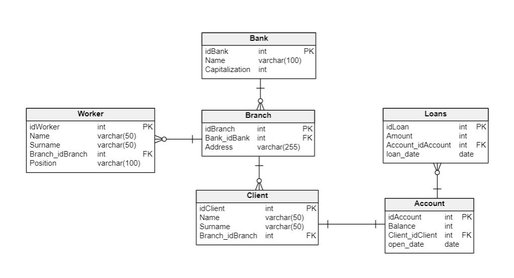
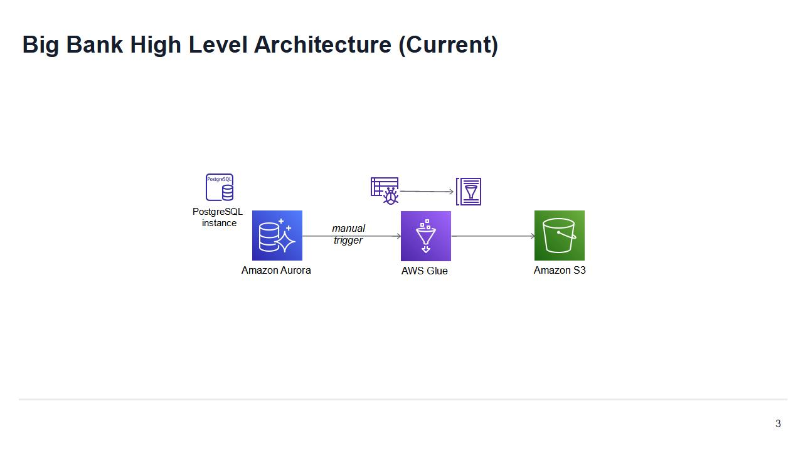
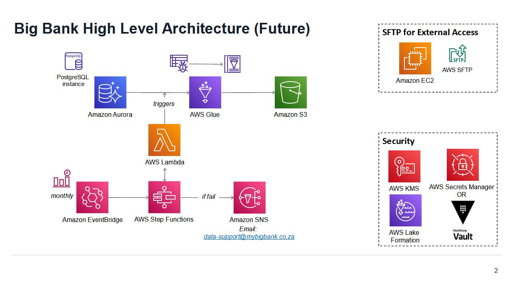

# Context
The code enclosed is part of a Data Engineering project for a Banking group.
The primary requirement is to create a monthly extract of data from their Aurora cluster into a CSV file on S3, to be consumed by an external system.

There are three different banks in the group.

An Amazon Aurora cluster (postgres flavour) houses their Operational Data Store.

The Aurora database has the following data model:

# Solution Overview

1. A high-level architecture can be found at: 
   A more complete future state architecture can be found at:  

2. Assumptions
   1. Appropriate network connectivity (VPC endpoints, etc.) has been setup to allow Glue to access the Aurora database
   2. The user/role executing the teraform code has sufficient permissions to create all the required objects
   3. The data volumes from the Aurora database would be large enough to discourage the use of pandas or other in-memory computing
   4. There is a development and a production AWS environment (reflected in the use of the dev environment specific terraform variables)

3. The solution consists of Terraform code to deploy the required resources in the required AWS account, plus a Python/PySpark script for AWS Glue to perform the required ETL 

4. An initial/MVP version of the solution was implemented, but further enhancements are possible with additional time

# Code Produced

1. Terraform
   1. main.tf
      This contains the main terraform execution code, and produces:
         1. An IAM role for Glue
         2. An S3 bucket for results, and one for glue scripts to be stored, both encrypted with SSE-S3
         3. A Glue catalog/database
         4. A glue connection + crawler targeting the Aurora source database
         5. A glue job referencing 
   
   2. variables.tf
      A list of variables to be supplied when executing the code. 
      Broken into secrets/credentials, tags, and configuration variables
   
   3. dev_environment.tfvars
      This set of variables assumes a development environment, and is the only set of configuration and tags variables currently defined.
      If the code runs as expected and is approved for deployment an equivalent set of variables could be set up for the production environment (assuming multiple environments were used)

   4. secrets.tfvars
      This file contains database credentials which should be securely stored (username, password, etc.).
      For now these have been separated into a different file which can be managed independently, and have been marked as sensitive, but this is not entirely adequate (see Extensions below)

2. Python/PySpark
   1. etl.py
      This a script to be executed by AWS Glue. It should be stored in the location set in the terraform code (in the environment variables) once the AWS environment has been launched.
      The code:
         1. Reads in all relevant tables from the Aurora database (assuming it has been crawled, and the metadata has been loaded into the Glue catalog)
         2. Performs a custom SQL transformation to join and aggregate the required tables for a sum of loan amounts per month, per branch, per bank
         3. Writes out the results to S3 in a partitioned structure (Bank_Name/Year/Month). The files are currently written to single arbitrarily named files per partition, but a client request to be implemented in future is to have the csv files named 'BankName_YYYYMMDD.csv'

# Extensions/Improvements
The following are possible future extensions/amendments to the current solution:

1. Security
   To expand the security of the current solution, the following should be implemented:
   1. Storing of database credentials in a secure external tool to avoid the need to store any information in code or local files. 
      The ideal options are AWS Secrets Manager (recommended) or HashiCorp Vault. Both would allow the pulling of credentials from a secure server, but Vault would have the benefit of avoiding any manual steps in the case of re-deployment of the platform (as the Secrets would be need to be created manually)
      The current solution (using 'Sensitive' Terraform variables) will avoid the display of credentials in the log files, but will still store the credentials in the code, and in the state file.
   2. Data in S3 should be encrypted with a managed key, ideally AWS KMS
      Access to the key would need to be provided to all users/roles that would access the data, including the Glue Job
   3. Depending on requirements, data could be further secured with Lake Formation, allowing more fine grained access control of the files in S3 and Glue catalog tables 

2. Orchestration
   The current solution would require all jobs to be run manually. This should ideally be scheduled at the desired frequency along with error handling. This could be achieved with:
   1. Glue Triggers
      This would allow adding a simple trigger to the Glue Job to ensure it runs on an automated fashion at a given time each week/month. This would have limited error handling/response functionality.

   2. Lambda, Step Functions, EventBridge, SNS
      This solution, as depicted in the future state architecture, would have the advantage of highly increased flexibility vs. a Glue Trigger, plus allowing more advanced error handling (including sending an alert email)

3. Addition of file naming for CSV output files written
   The files are currently arbitrarily named, but were requested with the namign convention 'BankName_YYYYMMDD.csv'. This can be achieved with some effort, but may have an impact on the code performance & maintainability.

3. SFTP Access 
   The client has optionally requested that an SFTP be setup to allow external access to the files on S3 via an SFTP. This has not been properly investigated yet.

4. Modularisation of code, especially Terraform code 