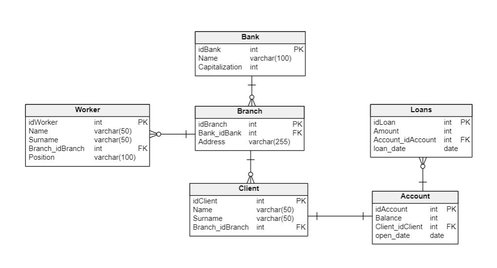

# senior-data-engineer-coding-interview

In Git, please create a `feature/` branch, off of the `development` branch, using your name and surname as the branch name.

Submit a pull request into the `development` branch once you're done coding.

# Problem Statement

You are consulting on a Banking group's Data Engineering project and need to create a monthly extract of data from their Aurora cluster into a CSV file on S3, to be consumed by an external system.

There are three different banks in the group.

An Amazon Aurora cluster (postgres flavour) houses their Operational Data Store.

Connection details are:
mycluster.cluster-123456789012.us-east-1.rds.amazonaws.com
(Please use the default postgres port to connect)
username: `postgres`
password: `5Y67bg#r#`

Given the following data model:

# Perform the following tasks

1. Write code to deploy the following resources via Terraform:

(Put this code in the file `Terraform/main.tf`)

* A Glue Crawler to crawl this datasource
* A Glue Catalog Database to persist the metadata
* A Glue Job which will read data from this datasource and write it to S3
* An S3 bucket to house the transformed dataset
* Any other terraform resources you might require

2. Write a Glue ETL script (use the file `Glue/etl.py`), containing scaleable business logic to calculate the moving average of loan amounts taken out over the last three months, per branch.
   1. Create a separate monthly output file for each bank in the group.
   2. Files need to be partitioned by Bank Name, Year and Month and the filename needs to be of the format BankName_YYYYMMDD.csv
   
3. Remember, bonus points can be earned, if you really want to impress your client, by adding some of the following:
   1. Create an SFTP server on EC2 (using Terraform), which makes the contents of the S3 bucket containing the extracts available to the external system
   2. Build in some form of scheduling and an orchestration layer which includes notifications upon job failure to a support email address (data-support@mybigbank.co.za)
   3. Ensure idempotency of the ETL system
   4. Keep passwords and connection details secure. In fact, passwords should probably be rotated and S3 data should probably be encrypted...
   5. Add comments and logging to your code
   6. Documentation is always nice, especially if you're good at drawing architectual diagrams. Please add any documentation you create to a separate README file.
   7. Anything else we did not specify in the task outline, but which you think will add value to your solution (keep in mind templatisability for reuse of your code by other team members)