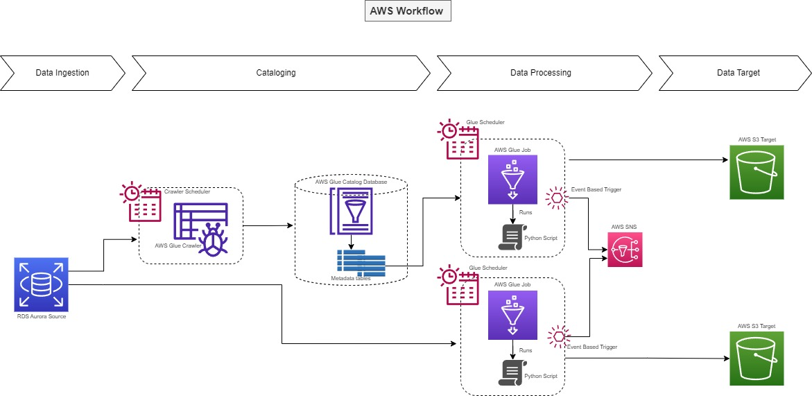
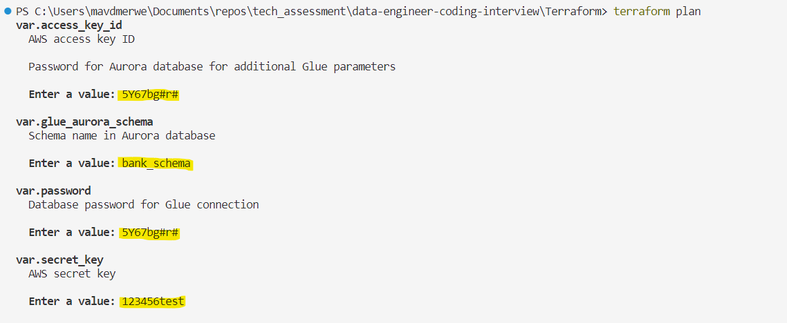

# AWS Terraform Bank Workflow

---

The script contains resources to build AWS resources to perform various tasks, such as storing files and objects related to a banking application, calculating moving averages, and executing Python scripts. It also includes server-side encryption configurations to ensure the security of the stored objects. Additionally, the script sets up a Key Management Service (KMS) key for data encryption, establishes a Glue connection for accessing data sources, defines an IAM role with associated permissions, creates an SNS topic for message publishing and subscribing, manages a Glue catalog database for organizing metadata, and automates data source discovery and cataloging using an AWS Glue crawler. Furthermore, it provisions a Glue job for executing ETL (Extract, Transform, Load) processes on the data and runs Python scripts to perform specific data transformations and analyses as needed.

---



## Resources:

1. AWS S3 buckets (Count 3):
2. AWS S3 bucket server-side encryption configurations (Count 3):
3. AWS S3 objects (Count 2):
4. AWS KMS key (Count 1):
5. AWS KMS alias (Count 1):
6. AWS Glue connection (Count 1):
7. AWS IAM role (Count 1):
8. AWS IAM role policy (Count 1):
9. AWS SNS topic (Count 1):
10. AWS SNS topic subscription (Count 1):
11. AWS Glue catalog database (Count 1):
12. AWS Glue crawler (Count 1):
13. AWS Glue security configuration (Count 1):
14. AWS Glue job (Count 2):
15. AWS Glue trigger (Count 2):
16. AWS Cloudwatch Event Rule (Count 1):

## How to run:
Terraform Initialization: Run this command to initialize the Terraform working directory by downloading the required provider plugins and modules.

```
terraform init
```

Terraform Plan: Use this command to create an execution plan that shows what actions Terraform will take when applying your configuration.

```
terraform plan
```
Terraform Apply: Run this command to apply the changes defined in your Terraform configuration and provision the AWS resources.

```
terraform apply
```
Note: Before running this command, make sure you have reviewed the execution plan from the previous step and are ready to proceed with the resource creation.

Terraform Destroy: If you want to tear down the AWS resources created by Terraform, you can use this command to destroy all the resources defined in your configuration.

```
terraform destroy
```
Note: Exercise caution when running this command, as it will permanently delete the resources and their data.

## Terraform Prompts
To ensure security, certain variables such as access_key_id, secret_key, aurora_password, and database_schema have been omitted from the code. When executing the Terraform script, the user will be prompted to enter the appropriate values for these variables. This approach ensures that sensitive information remains protected during the script execution.

