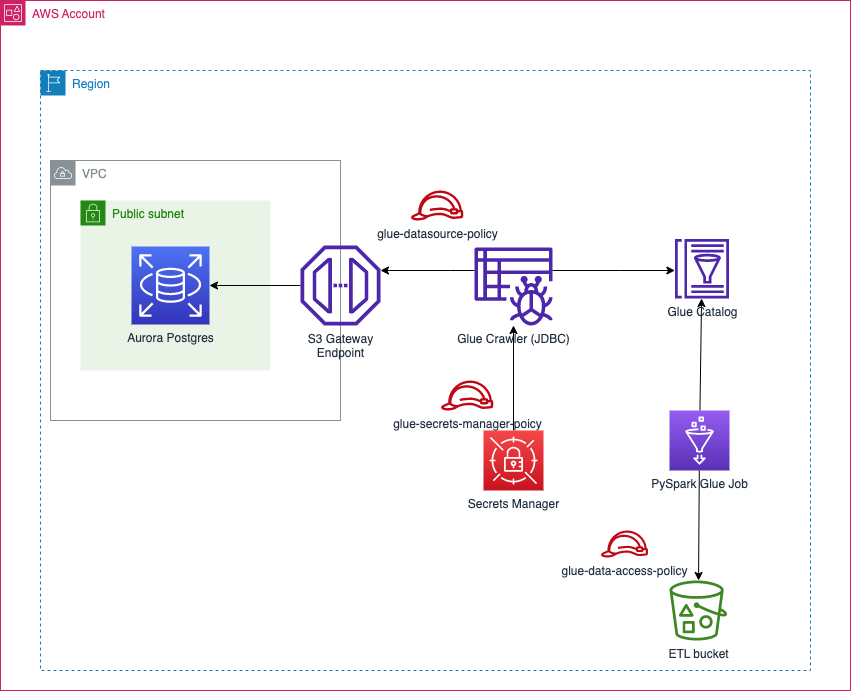

# Solution overview

### Assumptions
1) The RDS Aurora postgres cluster is deployed in a private subnet of the VPC
2) Networking between the VPC and the AWS Glue service has been configured
   1) A S3 Gateway endpoint was used
   2) Security groups with self referencing inbound and outbound rules are setup
   3) RDS is configured to enforce SSL communication between itself and clients
3) The database user credentials are stored in the AWS Secrets Manager service so that credentials are not hardcoded in the Terraform code and risk being exposed from the Github repo
4) All other AWS infrastructure that is not part of the RDS service is deployed in the same region as the RDS cluster. This POC uses the eu-west-1 region. Change the default region in the `provider.tf`

### TODO
1) Resolve SSL error between RDS and Glue. Using the bundled certs results in a host mismatch error in Glue
2) Make use of AWS Glue job bookmark to perform incremental processing
3) Make use of either Glue Workflow or Step functions for orchestration
4) Add retry logic to cope with failure and become 'self healing'
5) Add notifications & metrics
6) Derive a reusable Terraform module from this initial code base that could be used in other ETL pipelines
7) Add trigger that will supply Glue DB and table name as well as S3 destination path
8) Use appropriate amount of workers in the Glue Job definition